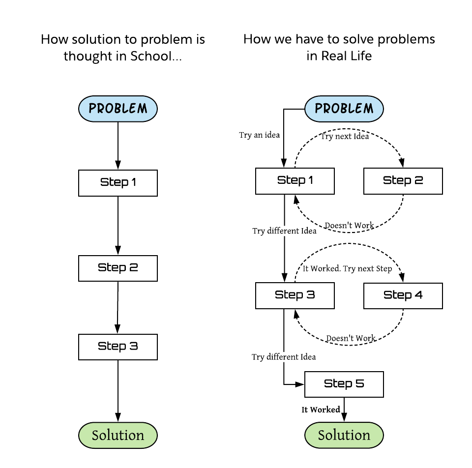

## How LMES can help create Scientists and Entrepreneurs?

---

---

### Is just lack of practical knowledge only problem ? 

*** What LMES can do to create Entrepreneurs and Scientists? ***

---

*** What is School for? ***

---

*** Are we asking our students to collect the dots or connect the dots ? ***

---

*** Collect the dots ***

* Today’s school system teaches students only to collect the dots. i.e teach knowledge.
* In old age knowledge is scarce. So industrial age introduced educational system to create factory workers.
* So we are thought to collect the dots, scored based on how many dots you have collected.

---

*** Connect the dots ***

>  Creativity is just connecting things - Steve Jobs

Uber is a good example.

---

** School teach nothing about how to connect those dots **

* The current system is created for world with no wikipedia, no google or internet.
* Before we had super computer in our packet.
* In new technological age, all the information is just a click away.

---

** Students should know how to connect the dots to succeed in future jobs. **

* In future, most of the manual “factory work” will be replaced by machines.
* We can’t teach connecting dots in a text book.

---

*** How schools can teach students to collect the dots and at the same time ensuring that they collect enough dots pass the test? ***

* People who are happy and successful are not there because they know more stuff or got good grades.
* They also have to insight and intuition to connect disparate streams of information and turn it in to whole new way of thinking.

---

### We should stop teaching collecting the dots

Instead we need to teach intention to learn and how to think.

---

### LMES does great job in creating “Intention to learn”

* Making learning fun and interesting
* Creating curiosity in students to learn.
* Get practical understanding of knowledge.

---

** To create entrepreneurs and scientists, We also need to teach: **

* How to connect dots to create new ideas ? 
* How to think ? 

---

### Few ideas for LMES

---

** Don’t simply teach the solution, but fundamental problem solving skills **

* First show wrong way to do it, then how to get insights from it to arrive at correct answer.
* Encourage students to try something, make mistakes and learn from it.

---

** Teaching the process to solve the problem is important that teaching the solution itself **

---

** Teach history of Invention **

*How Archimedes calculated approximate value of `π` 2000 years before ?* 

---

** Teach how to learn **

* Just in case vs Just in time learning *

> Today, you need to be a life long learner 

### Give opportunity for students to figure out

* Create a teaser video of a problem and show solution in the next video.

---

### Key Message ##

> Education is not the learning of facts, but training the mind to think -- Albert Einstien.

### LMES can really help create entrepreneurs and scientists.

> LMES already doing great job to help students to learn practical knowledge. They have more than 5 lakh followers. They work with schools, colleges and conduct workshops. 

I just want to pass on some ideas so it can benefit lot of students.

---

### Thank You.

---

